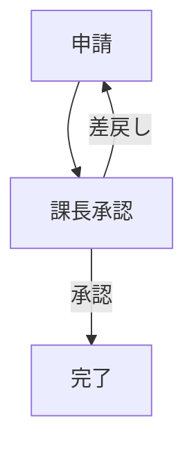
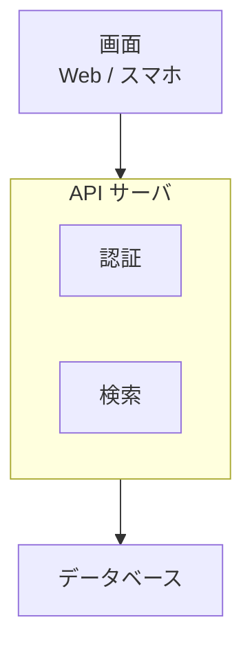

# 図の書き方（Mermaid）

流れ図や構成図が理解を助けるときだけ、回答の文章の中に ```mermaid ブロックで flowchart を書く。図が不要な質問では使わない。

## 流れ図

```mermaid
flowchart TD
  A[申請] --> B[課長承認]
  B -->|承認| C[完了]
  B -->|差戻し| A
```

## 構成図
上から下へ `flowchart TB` で層を並べ、層の中の要素は subgraph で囲む。

```mermaid
flowchart TB
  web[画面<br>Web / スマホ]
  subgraph api[API サーバ]
    auth[認証]
    search[検索]
  end
  db[データベース]
  web --> api --> db
```
